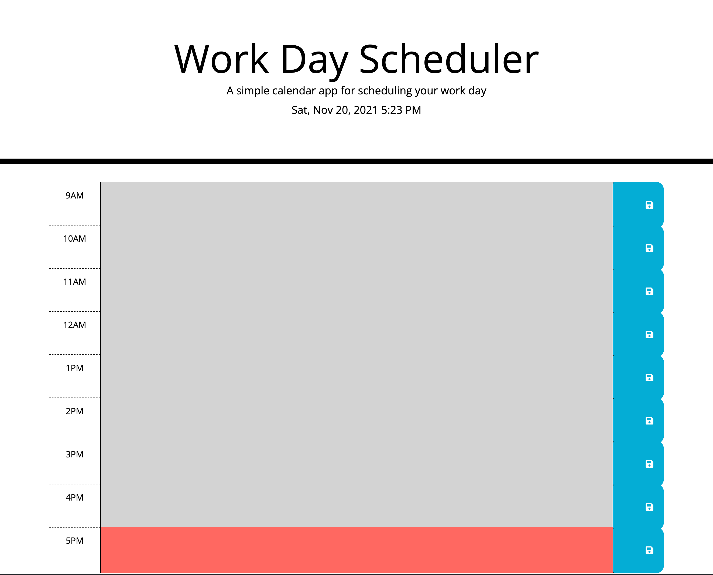

# NEVER MISS A TASK SCHEDULER

## What Is It?

A calendar application that allows a user to save events for each hour of the day. This app will run in the browser and feature dynamically updated HTML and CSS powered by jQuery.

## How Does It Work?

This app uses Moment.js to display the current date and time at the top of the page.

The scheduler itself has time blocks for regular work hours from 9-5. The current time block will be highlighted in red, the time blocks that have already past will be grey coloured and the time blocks that have yet to pass will be green coloured.

You can type what ever tasks you wish to have stored and press the save button, even if you close the web browser your information will still persist.

If you want to remove a task, just delete what you have written and press save.

## Website

[Never Miss A Task Scheduler](https://danielarzani.github.io/Never-Miss-A-Task-Scheduler/)

## Built With

- HTML
- CSS / Bootstrap
- Jquery

## Contributions

University of Toronto Bootcamp: course material, classmates, instructors.

by Daniel Arzanipour
